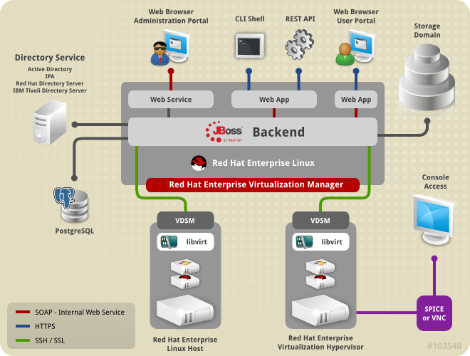

= Red Hat Cloud Infrastructure (RHCI).

== Objetivo.

Red Hat Cloud Infrastructure es una suite que permite construir y manejar distintos tipos de proveedores de infraestructura, 
las cuales pueden  ser tecnologías de virtualización tradicional (Vmware, Hyper-v, Red Hat), Infraestructura como Servicio 
(IaaS / Openstack), como proveedores de Plataforma como Servicio (Contenedores / Openshift).

Con RHCI, puedes implementar una infraestructura integrada para incrementar el valor de tu departamento de T.I, mejorar el
control de recursos y reducir el TCO.

El presente TestDrive consta de 3 ejercicios principales, se divide en 2 partes y tiene como objetivo el poder utilizar 
las soluciones que se encuentran en RHCI, en algunos casos desde su instalación básica, entender y verificar la funcionalidad
de cada una de ellas y sobre todo comprobar de propia mano que estas suite es la solución adecuada para optimizar tu infraestructura.

---
== ¿Qué es Red Hat Virtualization?

Red Hat Virtualization es una plataforma de virtualización de nivel empresarial basada en Red Hat Enterprise Linux. 
La virtualización permite a los usuarios aprovisionar fácilmente nuevos servidores virtuales y estaciones de trabajo, y 
proporciona un uso más eficiente de los recursos del servidor físico. Con Red Hat Virtualization, puede administrar toda 
su infraestructura virtual, incluidos hosts, máquinas virtuales, redes, almacenamiento y usuarios, desde una interfaz 
gráfica de usuario centralizada o API RESTful.

* Arquitectura Red Hat Virtualization.

=== DISCLAIMER
Que *NO ES* este laboratorio:

  • No es una arquitectura de referencia.
  • No es un curso de implementación.
  • No es un manual de mejores prácticas.
  • No es una referencia para implementar.
  • No es un ambiente productivo
  • No es un entorno de prueba.

*Es solo un ejercicio para poder probar la funcionalidad.*

= Laboratorio A
== Ejercicio 1.

= Instalación y configuración de Red Hat Virtualization.
El siguiente diagrama describe el procedimiento de configuración para una implementación de Manager independiente y una implementación de motor autohospedado.

image::./img/RHEV_SHE_454569_0717_JCS_deployment_02.png[Procedimiento]

Una vez que haya instalado un sistema operativo Red Hat Enterprise Linux y se haya asegurado de que el sistema cumpla con los  registros necesarios de una suscripción de Red Hat será necesario suscribir a los repositorios necesarios para instalar los paquetes de Red Hat Virtualization Manager (RHV-M).

TIP: Este proceso a sido realizado durante el deployment del ambiente.

:sectnums:
=== Conectarse vía ssh al equipo asignado como Manager (utilizar ip asignada por laboratorio)
----
ssh -l root 35.190.175.2
The authenticity of host '35.190.175.2 (35.190.175.2)' can't be established.
ECDSA key fingerprint is SHA256:LfUxCe2zUvXOI1cYBKKsYs1zBiEVrs0RBkBOtyXnnxk.
ECDSA key fingerprint is MD5:5c:5d:4d:d6:24:a2:36:55:c9:29:af:2c:4e:f0:b8:6b.
Are you sure you want to continue connecting (yes/no)? yes
Warning: Permanently added '35.190.175.2' (ECDSA) to the list of known hosts.
root@35.190.175.2's password:
Last login: Wed Oct  4 13:29:24 2017 from 189.216.165.215
----

=== Antes de poder configurar y utilizar RHV - Manager, debe instalar el paquete y las dependencias de rhevm.

Para asegurarse que todos los paquetes estén actualizados, ejecute el siguiente comando en la máquina donde está instalando Red Hat Virtualization Manager:
----
[root@manager ~]# # yum update -y
----

WARNING: Reinicie la máquina si se han actualizado paquetes relacionados con el kernel.

=== Asignar hostname del RHV-Manager.

Es importante que antes de comenzar con el proceso de instalación tengamos configurado el nombre de nuestro RHV - Manager
debido a que durante el proceso de configuración se auto-firmaran certificados de identidad los cuales son asociados al hostname.

----
[root@manager ~]# hostnamectl set-hostname manager.example.com
----

=== Ejecute el siguiente comando para instalar el paquete y las dependencias de rhevm 
----
[root@manager ~]# yum install rhvm -y
Loaded plugins: product-id, search-disabled-repos, subscription-manager
Resolving Dependencies
--> Running transaction check
---> Package rhvm.noarch 0:4.2.0.2-0.1.el7 will be installed
--> Processing Dependency: ovirt-engine = 4.2.0.2-0.1.el7 for package: rhvm-4.2.0.2-0.1.el7.noarch
--> Processing Dependency: ovirt-log-collector >= 4.2.0 for package: rhvm-4.2.0.2-0.1.el7.noarch
---> Package ovirt-engine.noarch 0:4.2.0.2-0.1.el7 will be installed
--> Processing Dependency: ovirt-engine-backend = 4.2.0.2-0.1.el7 for package: ovirt-engine-4.2.0.2-0.1.el7.noarch
--> Processing Dependency: ovirt-engine-dbscripts = 4.2.0.2-0.1.el7 for package: ovirt-engine-4.2.0.2-0.1.el7.noarch

...Trunk Output

---> Package perl-Pod-Perldoc.noarch 0:3.20-4.el7 will be installed
--> Processing Dependency: perl(HTTP::Tiny) for package: perl-Pod-Perldoc-3.20-4.el7.noarch
--> Processing Dependency: perl(parent) for package: perl-Pod-Perldoc-3.20-4.el7.noarch
---> Package perl-podlators.noarch 0:2.5.1-3.el7 will be installed
---> Package python-linecache2.noarch 0:1.0.0-1.el7ost will be installed
--> Running transaction check
---> Package perl-HTTP-Tiny.noarch 0:0.033-3.el7 will be installed
---> Package perl-parent.noarch 1:0.225-244.el7 will be installed
--> Finished Dependency Resolution

Dependencies Resolved

================================================================================================
 Package                      Arch      Version           Repository                             Size
================================================================================================
Installing:
 rhvm                        	noarch   4.2.0.2-0.1.el7    rhel-7-server-rhv-4-beta-rpms          7.9 k
Installing for dependencies:
 PyYAML                      	x86_64   3.10-11.el7        rhel-7-server-rpms                     153 k
 ansible                     	noarch   2.4.1.0-1.el7ae    rhel-7-server-rhv-4-beta-rpms          7.6 M
 ant                      		noarch   1.9.2-9.el7        rhel-7-server-rpms                     1.9 M
 antlr-tool                  	noarch   2.7.7-30.el7       rhel-7-server-rpms                     357 k
 aopalliance                	noarch   1.0-8.el7          rhel-7-server-rhv-4-tools-beta-rpms     11 k

...Trunk Output

 xml-commons-resolver     		noarch   1.2-15.el7         rhel-7-server-rpms                     108 k
 xmlrpc-client                noarch   1:3.1.3-8.el7      rhel-7-server-rhv-4-tools-beta-rpms     57 k
 xmlrpc-common              	noarch   1:3.1.3-8.el7      rhel-7-server-rhv-4-tools-beta-rpms    105 k
 xpp3                       	noarch   1.1.3.8-11.el7     rhel-7-server-rpms                     336 k
 xz-java                    	noarch   1.3-3.el7          rhel-7-server-rhv-4-tools-beta-rpms     89 k
 yajl                     		x86_64   2.0.4-4.el7        rhel-7-server-rpms                      39 k
 yum-plugin-versionlock      	noarch   1.1.31-42.el7      rhel-7-server-rpms                      32 k

Transaction Summary
======================================================================================================
Install  1 Package (+639 Dependent packages)

Total download size: 1.0 G
Installed size: 2.0 G
Downloading packages:
(1/640): PyYAML-3.10-11.el7.x86_64.rpm				                     	| 153 kB  00:00:00
(2/640): ant-1.9.2-9.el7.noarch.rpm                               	| 1.9 MB  00:00:00
(3/640): antlr-tool-2.7.7-30.el7.noarch.rpm                       	| 357 kB  00:00:00
(4/640): apache-commons-collections-3.2.1-22.el7_2.noarch.rpm     	| 509 kB  00:00:00
(5/640): apache-commons-beanutils-1.8.3-14.el7.noarch.rpm          	| 213 kB  00:00:00

...Trunk Output

(637/640): yajl-2.0.4-4.el7.x86_64.rpm                          	 |  39 kB  00:00:00
(638/640): yum-plugin-versionlock-1.1.31-42.el7.noarch.rpm         |  32 kB  00:00:00
(639/640): xz-java-1.3-3.el7.noarch.rpm                         	 |  89 kB  00:00:00
(640/640): rhv-guest-tools-iso-4.2-1.el7ev.noarch.rpm           	 | 273 MB  00:00:55
---------------------------------------------------------------------------------------------------------------------------
Total                                                             6.1 MB/s | 1.0 GB  00:02:49
Running transaction check
Running transaction test
Transaction test succeeded
Running transaction
  Installing : ruby-libs-2.0.0.648-30.el7.x86_64                          		1/640
  Installing : otopi-1.7.5-1.el7ev.noarch                                   	2/640
  Installing : openvswitch-2.7.3-2.git20171010.el7fdp.x86_64               		3/640

...Trunk Output

  Verifying  : jsr-311-1.1.1-6.el7.noarch                                 	637/640
  Verifying  : httpd-2.4.6-67.el7_4.6.x86_64                              	638/640
  Verifying  : eap7-hibernate-entitymanager-5.1.10-1....ep7.el7.noarch     	639/640
  Verifying  : 1:msv-msv-2013.5.1-7.el7.noarch                            	640/640

Installed:
  rhvm.noarch 0:4.2.0.2-0.1.el7

Dependency Installed:
  ant.noarch 0:1.9.2-9.el7
  antlr-tool.noarch 0:2.7.7-30.el7

...Trunk Output

  yajl.x86_64 0:2.0.4-4.el7
  yum-plugin-versionlock.noarch 0:1.1.31-42.el7

Complete!
----

=== Configuración de RHV-M
Después de haber instalado el paquete y las dependencias de rhevm , debe configurar Red Hat Virtualization Manager utilizando el comando engine-setup. Este comando le hace una serie de preguntas y, después de proporcionar los valores requeridos para todas las preguntas, aplica esa configuración e inicia el servicio ovirt-engine.

La descripción detallada de las tareas que realiza cada pregunta lo encuentra en el siguiente link.

https://access.redhat.com/documentation/en-us/red_hat_virtualization/4.2-beta/html-single/installation_guide/#Red_Hat_Enterprise_Virtualization_Manager_Configuration_Overview[CONFIGURACIÓN RED HAT VIRTUALIZATION]

WARNING: Seleccionar las opciones como se muestran a continuación

----
[root@manager ~]# engine-setup
----
* Configure Engine on this host (Yes, No) [Yes]: *Yes*
* Configure Image I/O Proxy on this host? (Yes, No) [Yes]: *Yes*
* Configure WebSocket Proxy on this host (Yes, No) [Yes]: *Yes*
* Configure Data Warehouse on this host (Yes, No) [Yes]: *Yes*
* Configure VM Console Proxy on this host (Yes, No) [Yes]: *Yes*
* Configure ovirt-provider-ovn (Yes, No) [Yes]: *Yes*
* Do you want Setup to configure the firewall? (Yes, No) [Yes]: *Yes*
* Where is the DWH database located? (Local, Remote) [Local]: *Local*
* Would you like Setup to automatically configure postgresql and create DWH database, or prefer to perform that manually? (Automatic, Manual) [Automatic]: *Automatic*
* Where is the Engine database located? (Local, Remote) [Local]: *Local*
* Would you like Setup to automatically configure postgresql and create Engine database, or prefer to perform that manually? (Automatic, Manual) [Automatic]: *Automatic*
* Engine admin password: *Redhat1!*
* Confirm engine admin password: *Redhat1!*
* Application mode (Virt, Gluster, Both) [Both]: *Both*
* Use default credentials (admin@internal) for ovirt-provider-ovn (Yes, No) [Yes]: *Yes*
* Default SAN wipe after delete (Yes, No) [No]: *No*
* Organization name for certificate [example.com]: *Enter*
* Do you wish to set the application as the default page of the web server? (Yes, No) [Yes]: *Yes*
* Setup can configure apache to use SSL using a certificate issued from the internal CA. Do you wish Setup to configure that, or prefer to perform that manually? (Automatic, Manual) [Automatic]: *Automatic*
* Please choose Data Warehouse sampling scale: *1*

=== El preview de configuración quedará de la siguiente forma:
----
[ INFO  ] Stage: Setup validation

          --== CONFIGURATION PREVIEW ==--

          Application mode                        : both
          Default SAN wipe after delete           : False
          Firewall manager                        : firewalld
          Update Firewall                         : True
          Host FQDN                               : manager.example.com
          Configure local Engine database         : True
          Set application as default page         : True
          Configure Apache SSL                    : True
          Engine database secured connection      : False
          Engine database user name               : engine
          Engine database name                    : engine
          Engine database host                    : localhost
          Engine database port                    : 5432
          Engine database host name validation    : False
          Engine installation                     : True
          PKI organization                        : example.com
          Set up ovirt-provider-ovn               : True
          Configure WebSocket Proxy               : True
          DWH installation                        : True
          DWH database secured connection         : False
          DWH database host                       : localhost
          DWH database user name                  : ovirt_engine_history
          DWH database name                       : ovirt_engine_history
          DWH database port                       : 5432
          DWH database host name validation       : False
          Configure local DWH database            : True
          Configure Image I/O Proxy               : True
          Configure VMConsole Proxy               : True
----

=== Comienza el Proceso de configuración
----

          Please confirm installation settings (OK, Cancel) [OK]: OK
[ INFO  ] Stage: Transaction setup
[ INFO  ] Stopping engine service
[ INFO  ] Stopping ovirt-fence-kdump-listener service
[ INFO  ] Stopping dwh service
[ INFO  ] Stopping Image I/O Proxy service
[ INFO  ] Stopping vmconsole-proxy service
[ INFO  ] Stopping websocket-proxy service
[ INFO  ] Stage: Misc configuration
[ INFO  ] Stage: Package installation
[ INFO  ] Stage: Misc configuration
[ INFO  ] Upgrading CA
[ INFO  ] Initializing PostgreSQL
[ INFO  ] Creating PostgreSQL 'engine' database
[ INFO  ] Configuring PostgreSQL
[ INFO  ] Creating PostgreSQL 'ovirt_engine_history' database
[ INFO  ] Configuring PostgreSQL
[ INFO  ] Creating CA
[ INFO  ] Creating/refreshing Engine database schema
[ INFO  ] Creating/refreshing DWH database schema
[ INFO  ] Configuring Image I/O Proxy
[ INFO  ] Setting up ovirt-vmconsole proxy helper PKI artifacts
[ INFO  ] Setting up ovirt-vmconsole SSH PKI artifacts
[ INFO  ] Configuring WebSocket Proxy
[ INFO  ] Creating/refreshing Engine 'internal' domain database schema
[ INFO  ] Adding default OVN provider to database
[ INFO  ] Adding OVN provider secret to database
[ INFO  ] Setting a password for internal user admin
[ INFO  ] Generating post install configuration file '/etc/ovirt-engine-setup.conf.d/20-setup-ovirt-post.conf'
[ INFO  ] Stage: Transaction commit
[ INFO  ] Stage: Closing up
[ INFO  ] Starting engine service
[ INFO  ] Starting dwh service
[ INFO  ] Restarting ovirt-vmconsole proxy service

          --== SUMMARY ==--

[ INFO  ] Restarting httpd
          Please use the user 'admin@internal' and password specified in order to login
          Web access is enabled at:
              http://manager.example.com:80/ovirt-engine
              https://manager.example.com:443/ovirt-engine
          Internal CA 3B:E0:A2:A7:52:E2:50:67:D8:B3:F7:EE:42:6C:4F:3E:16:8E:020
          SSH fingerprint: SHA256:l7ioZsIBJoFYYMTUMaby7y96OHn+lWbmGSZ7g7/ueIk

          --== END OF SUMMARY ==--

[ INFO  ] Stage: Clean up
          Log file is located at /var/log/ovirt-engine/setup/ovirt-engine-setup-20180201113839-zwnhrs.log
[ INFO  ] Generating answer file '/var/lib/ovirt-engine/setup/answers/20180201114201-setup.conf'
[ INFO  ] Stage: Pre-termination
[ INFO  ] Stage: Termination
[ INFO  ] Execution of setup completed successfully
----

=== Conectándose al Portal de Administración. (utilizar ip asignada por laboratorio)

Acceda al Portal de administración utilizando un navegador web.

  1 En un navegador web, vaya a, {manager-fqdn} con el nombre de dominio completo que proporcionó durante la instalación. https://your-manager-fqdn/ovirt-engine.

  2 Haga clic en Portal de administración. Se muestra una página de inicio de sesión de SSO. El inicio de sesión de SSO le permite iniciar sesión en la administración y en el portal de VM al mismo tiempo.

  3 Ingrese su nombre de usuario y contraseña. Si está iniciando sesión por primera vez, use el nombre de usuario admin junto con la contraseña que especificó durante la instalación.

  4 Seleccione el dominio contra el cual autenticar desde la lista de Dominios. Si está iniciando sesión con el nombre de usuario administrador interno , seleccione el dominio interno.

  5 Haga clic en Iniciar sesión.

  6 Puede ver el Portal de administración en varios idiomas. La selección predeterminada se elegirá en función de la configuración regional de su navegador web. Si desea ver el Portal de administración en un idioma que no sea el predeterminado, seleccione su idioma preferido de la lista desplegable en la página de bienvenida.

== Ejercicio 2.

= Instalación y configuración de Red Hat Host.

Red Hat Virtualization soporta dos tipos de hosts: Red Hat Virtualization Hypervisor (RHVH) y Red Hat Enterprise Linux Host. Dependiendo de los requisitos de su entorno, es posible que desee utilizar un solo tipo o ambos en su entorno Red Hat Virtualization. Se recomienda instalar y conectar al menos dos hosts al entorno Red Hat Virtualization. Cuando adjunte solo un host, no podrá acceder a características como migración en vivo y la alta disponibilidad.

----
ssh -l root 104.196.124.183
The authenticity of host '104.196.124.183 (104.196.124.183)' can't be established.
ECDSA key fingerprint is SHA256:LfUxCe2zUvXOI1cYBKKsYs1zBiEVrs0RBkBOtyXnnxk.
ECDSA key fingerprint is MD5:5c:5d:4d:d6:24:a2:36:55:c9:29:af:2c:4e:f0:b8:6b.
Are you sure you want to continue connecting (yes/no)? yes
Warning: Permanently added '104.196.124.183' (ECDSA) to the list of known hosts.
root@104.196.124.183's password:
Last failed login: Thu Feb  1 11:46:06 CST 2018 from 157.192.196.104.bc.googleusercontent.com on ssh:notty
There were 14 failed login attempts since the last successful login.
Last login: Wed Oct  4 13:29:24 2017 from 189.216.165.215
----

=== Instalación de paquete cockpit-ovirt-dashboard.

Un host de Red Hat Enterprise Linux, también conocido como hipervisor basado en RHEL, se basa en una instalación básica estándar de Red Hat Enterprise Linux en un servidor físico

Asegúrese de que todos los paquetes actualmente instalados estén actualizados:

----
[root@manager ~]# yum update -y
----
Puede instalar una interfaz de usuario de Cockpit para supervisar los recursos del host y realizar tareas administrativas.

Cockpit es un administrador de servidor que facilita la administración de sus servidores GNU/Linux a través de un navegador web.

----
[root@hiper1 ~]# yum install cockpit-ovirt-dashboard
Loaded plugins: product-id, search-disabled-repos, subscription-manager
Resolving Dependencies
--> Running transaction check
---> Package cockpit-ovirt-dashboard.noarch 0:0.10.10-0.el7ev will be installed
--> Processing Dependency: otopi >= 1.5.2-1 for package: cockpit-ovirt-dashboard-0.10.10-0.el7ev.noarch
--> Processing Dependency: vdsm >= 4.17.999-610 for package: cockpit-ovirt-dashboard-0.10.10-0.el7ev.noarch

...Trunk Output

--> Running transaction check
---> Package perl-HTTP-Tiny.noarch 0:0.033-3.el7 will be installed
---> Package perl-parent.noarch 1:0.225-244.el7 will be installed
--> Finished Dependency Resolution

Dependencies Resolved

============================================================================================================================
 Package                           Arch            Version                          Repository                      Size
============================================================================================================================
Installing:
 cockpit-ovirt-dashboard      noarch        0.10.10-0.el7ev                   rhel-7-server-rhv-4-mgmt-agent-rpms      7.0 M
 OVMF                         noarch        20170228-5.gitc325e41585e3.el7    rhel-7-server-rpms                       1.5 M
 OpenIPMI-modalias            x86_64        2.0.19-15.el7                     rhel-7-server-rpms                        15 k

...Trunk Output

 xmlrpc-c                         x86_64          1.32.5-1905.svn2451.el7     rhel-7-server-rpms                       130 k
 xmlrpc-c-client                  x86_64          1.32.5-1905.svn2451.el7     rhel-7-server-rpms                        32 k
 yajl                             x86_64          2.0.4-4.el7                 rhel-7-server-rpms                        39 k
Transaction Summary
========================================================================================
Install  1 Package (+325 Dependent packages)

Total download size: 112 M
Installed size: 353 M
Is this ok [y/d/N]: y
Downloading packages:
(1/326): OpenIPMI-modalias-2.0.19-15.el7.x86_64.rpm                       |  15 kB  00:00:00
(2/326): PyYAML-3.10-11.el7.x86_64.rpm                                    | 153 kB  00:00:00
(3/326): OVMF-20170228-5.gitc325e41585e3.el7.noarch.rpm                   | 1.5 MB  00:00:00

...Trunk Output

(324/326): xmlrpc-c-client-1.32.5-1905.svn2451.el7.x86_64.rpm             |  32 kB  00:00:00
(325/326): yajl-2.0.4-4.el7.x86_64.rpm                                    |  39 kB  00:00:00
(326/326): yum-utils-1.1.31-42.el7.noarch.rpm                             | 117 kB  00:00:00
------------------------------------------------------------------------------------------
Total                                                                    2.5 MB/s | 112 MB  00:00:45
Running transaction check
Running transaction test
Transaction test succeeded
Running transaction
  Installing : satyr-0.13-14.el7.x86_64                                       1/326
  Installing : ruby-libs-2.0.0.648-30.el7.x86_64                              2/326
  Installing : yajl-2.0.4-4.el7.x86_64                                        3/326

...Trunk Output

  Verifying  : seabios-bin-1.10.2-3.el7_4.1.noarch                          324/326
  Verifying  : abrt-addon-pstoreoops-2.1.11-48.el7.x86_64                   325/326
  Verifying  : setools-libs-3.3.8-1.1.el7.x86_64                            326/326

Installed:
  cockpit-ovirt-dashboard.noarch 0:0.10.10-0.el7ev
Dependency Installed:
  OVMF.noarch 0:20170228-5.gitc325e41585e3.el7     OpenIPMI-modalias.x86_64 0:2.0.19-15.el7       PyYAML.x86_64 0:3.10-11.el7
  abrt.x86_64 0:2.1.11-48.el7                      abrt-addon-ccpp.x86_64 0:2.1.11-48.el7         abrt-addon-

...Trunk Output

  vdsm-xmlrpc.noarch 0:4.19.45-1.el7ev             vdsm-yajsonrpc.noarch 0:4.19.45-1.el7ev           virt-v2v.x86_64 
  xmlrpc-c.x86_64 0:1.32.5-1905.svn2451.el7        xmlrpc-c-client.x86_64 0:1.32.5-1905.svn2451.el7  yajl.x86_64
  yum-utils.noarch 0:1.1.31-42.el7

Complete!
----

=== Habilitar e iniciar servicio cockpit
----
[root@hiper1 ~]# systemctl enable cockpit.socket
Created symlink from /etc/systemd/system/sockets.target.wants/cockpit.socket to /usr/lib/systemd/system/cockpit.socket.

[root@hiper1 ~]# systemctl start cockpit.socket
----

=== Modificar hostname de equipo RHV-H
----
[root@hiper1 ~]# hostnamectl set-hostname hiper1.example.com
----

=== Reinicio de equipo
----
[root@hiper1 ~]# reboot
PolicyKit daemon disconnected from the bus.
We are no longer a registered authentication agent.
Connection to 104.196.124.183 closed by remote host.
Connection to 104.196.124.183 closed.
----

=== Conectarse vía ssh a equipo asignado de Storage (utilizar ip asignada por laboratorio)
----
ssh -l root 35.196.62.237
The authenticity of host '35.196.62.237 (35.196.62.237)' can't be established.
ECDSA key fingerprint is SHA256:LfUxCe2zUvXOI1cYBKKsYs1zBiEVrs0RBkBOtyXnnxk.
ECDSA key fingerprint is MD5:5c:5d:4d:d6:24:a2:36:55:c9:29:af:2c:4e:f0:b8:6b.
Are you sure you want to continue connecting (yes/no)? yes
Warning: Permanently added '35.196.62.237' (ECDSA) to the list of known hosts.
root@35.196.62.237's password:
Last login: Wed Oct  4 13:29:24 2017 from 189.216.165.215
----

=== Enlistar particiones en disco
----
[root@storage ~]# fdisk -l

Disk /dev/sda: 214.7 GB, 214748364800 bytes, 419430400 sectors
Units = sectors of 1 * 512 = 512 bytes
Sector size (logical/physical): 512 bytes/4096 bytes
I/O size (minimum/optimal): 4096 bytes/4096 bytes
Disk label type: dos
Disk identifier: 0x000ad69e

   Device Boot      Start         End      Blocks   Id  System
/dev/sda1   *        2048     2099199     1048576   83  Linux
/dev/sda2         2099200    31457279    14679040   8e  Linux LVM

Disk /dev/mapper/rhel-root: 13.4 GB, 13417578496 bytes, 26206208 sectors
Units = sectors of 1 * 512 = 512 bytes
Sector size (logical/physical): 512 bytes/4096 bytes
I/O size (minimum/optimal): 4096 bytes/4096 bytes

Disk /dev/mapper/rhel-swap: 1610 MB, 1610612736 bytes, 3145728 sectors
Units = sectors of 1 * 512 = 512 bytes
Sector size (logical/physical): 512 bytes/4096 bytes
I/O size (minimum/optimal): 4096 bytes/4096 bytes
----
=== Enlistar Volume Groups
----
[root@storage ~]# vgs
  VG   #PV #LV #SN Attr   VSize  VFree
  rhel   1   2   0 wz--n- 14.00g    0
----
=== Enlistar Physical Volumes
----
[root@storage ~]# pvs
  PV         VG   Fmt  Attr PSize  PFree
  /dev/sda2  rhel lvm2 a--  14.00g    0
----
=== Crear una nueva partición en dispositivo /dev/sda
----
[root@storage ~]# fdisk /dev/sda

The device presents a logical sector size that is smaller than
the physical sector size. Aligning to a physical sector (or optimal
I/O) size boundary is recommended, or performance may be impacted.
Welcome to fdisk (util-linux 2.23.2).

Changes will remain in memory only, until you decide to write them.
Be careful before using the write command.
----
=== Seleccionar "n" para nueva partición
----

Command (m for help): n
----
=== Seleccionar "p" para partición de tipo primaria
----
Partition type:
   p   primary (2 primary, 0 extended, 2 free)
   e   extended
Select (default p):
Using default response p
----
=== Presionar "Enter" para seleccionar numero de partición Default
----
Partition number (3,4, default 3):
First sector (31457280-419430399, default 31457280):
Using default value 31457280
----
=== Presionar "Enter" para seleccionar tamaño de partición Default
----
Last sector, +sectors or +size{K,M,G} (31457280-419430399, default 419430399):
Using default value 419430399
Partition 3 of type Linux and of size 185 GiB is set
----
=== Seleccionar "w" para escribir tabla de partición
----
Command (m for help): w
The partition table has been altered!

Calling ioctl() to re-read partition table.

WARNING: Re-reading the partition table failed with error 16: Device or resource busy.
The kernel still uses the old table. The new table will be used at
the next reboot or after you run partprobe(8) or kpartx(8)
Syncing disks.
----
=== Ejecutar lectura de nueva tabla de partición en dispositivo /dev/sda
----
[root@storage ~]# partprobe /dev/sda
----
=== Creación de nuevo Physical Volume en nueva partición
----
[root@storage ~]# pvcreate /dev/sda3
  Physical volume "/dev/sda3" successfully created.
----
=== Extender Volume Group "rhel" hacía el nuevo Physical Volume
----
[root@storage ~]# vgextend rhel /dev/sda3
  Volume group "rhel" successfully extended
----
=== Verificar nuevo tamaño de Volume Group
----
[root@storage ~]# vgs
  VG   #PV #LV #SN Attr   VSize   VFree
  rhel   2   2   0 wz--n- 198.99g 185.00g
----
=== Extender el Logical Volume /root con nuevo
----
[root@storage ~]# lvextend -L +160G /dev/rhel/root
  Size of logical volume rhel/root changed from 12.50 GiB (3199 extents) to 172.50 GiB (44159 extents).
  Logical volume rhel/root successfully resized.
----
=== Verificar nuevo tamaño de LOgical Volume
----
[root@storage ~]# lvscan
  ACTIVE            '/dev/rhel/swap' [1.50 GiB] inherit
  ACTIVE            '/dev/rhel/root' [172.50 GiB] inherit
----
=== Extender el Filesystem
----
[root@storage ~]# xfs_growfs /
meta-data=/dev/mapper/rhel-root  isize=512    agcount=4, agsize=818944 blks
         =                       sectsz=512   attr=2, projid32bit=1
         =                       crc=1        finobt=0 spinodes=0
data     =                       bsize=4096   blocks=3275776, imaxpct=25
         =                       sunit=0      swidth=0 blks
naming   =version 2              bsize=4096   ascii-ci=0 ftype=1
log      =internal               bsize=4096   blocks=2560, version=2
         =                       sectsz=512   sunit=0 blks, lazy-count=1
realtime =none                   extsz=4096   blocks=0, rtextents=0
data blocks changed from 3275776 to 45218816
----
=== Verificar el nuevo tamaño del Filesystem montado en /root
----
[root@storage ~]# df -h
Filesystem             Size  Used Avail Use% Mounted on
/dev/mapper/rhel-root  173G  971M  172G   1% /
devtmpfs               1.8G     0  1.8G   0% /dev
tmpfs                  1.9G     0  1.9G   0% /dev/shm
tmpfs                  1.9G  8.3M  1.8G   1% /run
tmpfs                  1.9G     0  1.9G   0% /sys/fs/cgroup
/dev/sda1             1014M  121M  894M  12% /boot
tmpfs                  371M     0  371M   0% /run/user/0
----
=== Crear directorio /exports para compartir almacenamiento vía NFS
----
[root@storage ~]# mkdir /exports
----
=== Cambiar owner de directorio /exports
----
[root@storage ~]# chown 36.36 /exports
----
=== Crear directorios user1/data
----
[root@storage ~]# cd /exports/
[root@storage exports]# mkdir user1
[root@storage exports]# mkdir user1/data
----
=== Cambiar owner de directorios dentro de /exports
----
[root@storage ~]# chown 36.36 -R /exports
----
=== Instalar paquete [package]`nfs-utils`
----
[root@storage exports]# yum install nfs*
Loaded plugins: product-id, search-disabled-repos, subscription-manager
Resolving Dependencies
--> Running transaction check
---> Package nfs-utils.x86_64 1:1.3.0-0.48.el7_4.1 will be installed
--> Processing Dependency: gssproxy >= 0.7.0-3 for package: 1:nfs-utils-1.3.0-0.48.el7_4.1.x86_64

--> Running transaction check
---> Package perl-HTTP-Tiny.noarch 0:0.033-3.el7 will be installed
---> Package perl-parent.noarch 1:0.225-244.el7 will be installed
---> Package python-backports.x86_64 0:1.0-8.el7 will be installed
--> Finished Dependency Resolution

Dependencies Resolved

========================================================================================
 Package                            Arch         Version                 Repository           Size
========================================================================================
Installing:
 nfs-utils                         x86_64      1:1.3.0-0.48.el7_4.1    rhel-7-server-rpms     398 k
 nfs4-acl-tools                    x86_64      0.3.3-15.el7            rhel-7-server-rpms      47 k
 nfsometer                         noarch      1.7-1.el7               rhel-7-server-rpms     133 k
 nfstest                           noarch      2.1.5-1.el7             rhel-7-server-rpms     529 k
Installing for dependencies:
 SDL                               x86_64      1.2.15-14.el7           rhel-7-server-rpms     204 k

...Trunk Output

 texlive-kpathsea-lib              x86_64      2:2012-38.20130427      rhel-7-server-rpms      78 k
 time                              x86_64      1.7-45.el7              rhel-7-server-rpms      30 k
Updating for dependencies:
 glib2                             x86_64      2.50.3-3.el7            rhel-7-server-rpms     2.3 M
 krb5-libs                         x86_64      1.15.1-8.el7            rhel-7-server-rpms     746 k

Transaction Summary
===================================================================================================
Install  4 Packages (+126 Dependent packages)
Upgrade             (   2 Dependent packages)

Total download size: 78 M
Is this ok [y/d/N]: y
Downloading packages:
Delta RPMs disabled because /usr/bin/applydeltarpm not installed.
warning: /var/cache/yum/x86_64/7Server/rhel-7-server-rpms/packages/SDL-1.2.15-14.el7.x86_64.rpm:
Header V3 RSA/SHA256 Signature, key ID fd431d51: NOKEY                          ]  0.0 B/s |    0 B  --:--:-- ETA
Public key for SDL-1.2.15-14.el7.x86_64.rpm is not installed
(1/132): SDL-1.2.15-14.el7.x86_64.rpm                                          | 204 kB  00:00:00
(2/132): agg-2.5-18.el7.x86_64.rpm                                             | 145 kB  00:00:00

...Trunk Output

(132/132): time-1.7-45.el7.x86_64.rpm                                          |  30 kB  00:00:00
-------------------------------------------------------------------------------------------------
Total                                                                          3.1 MB/s |  78 MB  00:00:25
Retrieving key from file:///etc/pki/rpm-gpg/RPM-GPG-KEY-redhat-release
Importing GPG key 0xFD431D51:
 Userid     : "Red Hat, Inc. (release key 2) <security@redhat.com>"
 Fingerprint: 567e 347a d004 4ade 55ba 8a5f 199e 2f91 fd43 1d51
 Package    : redhat-release-server-7.3-7.el7.x86_64 (@anaconda/7.3)
 From       : /etc/pki/rpm-gpg/RPM-GPG-KEY-redhat-release
Is this ok [y/N]: y
Importing GPG key 0x2FA658E0:
 Userid     : "Red Hat, Inc. (auxiliary key) <security@redhat.com>"
 Fingerprint: 43a6 e49c 4a38 f4be 9abf 2a53 4568 9c88 2fa6 58e0
 Package    : redhat-release-server-7.3-7.el7.x86_64 (@anaconda/7.3)
 From       : /etc/pki/rpm-gpg/RPM-GPG-KEY-redhat-release
Is this ok [y/N]: y
Running transaction check
Running transaction test
Transaction test succeeded
Running transaction
  Updating   : glib2-2.50.3-3.el7.x86_64                                       1/134
  Installing : 2:libpng-1.5.13-7.el7_2.x86_64                                  2/134
  Installing : libjpeg-turbo-1.2.90-5.el7.x86_64

  ...Trunk Output

  Verifying  : glib2-2.46.2-4.el7.x86_64 n                                   134/134

Installed:
  nfs-utils.x86_64 1:1.3.0-0.48.el7_4.1                                   nfs4-acl-tools.x86_64 0:0.3.3-15.el7
  nfsometer.noarch 0:1.7-1.el7                                            nfstest.noarch 0:2.1.5-1.el7

Dependency Installed:
  SDL.x86_64 0:1.2.15-14.el7                                              agg.x86_64 0:2.5-18.el7                             
  atlas.x86_64 0:3.10.1-12.el7                                            avahi-libs.x86_64 0:0.6.31-17.el7                   
  cairo.x86_64 0:1.14.8-2.el7                                             cups-libs.x86_64 1:1.6.3-29.el7                   
  
...Trunk Output

  texlive-dvipng.noarch 2:svn26689.1.14-38.el7                            texlive-dvipng-bin.x86_
  texlive-kpathsea-bin.x86_64 2:svn27347.0-38.20130427_r30134.el7         texlive-kpathsea-lib.x86_64

Dependency Updated:
  glib2.x86_64 0:2.50.3-3.el7                                             krb5-libs.x86_64 0:1.15.1-8.el7

Complete!
----

=== Modificar archivo en /etc/exports para configurar el compartido de almacenamiento por NFS::
----
[root@storage exports]# vi /etc/exports
----
=== Verificar configuración adecuada de NFS
----
[root@storage exports]# exportfs -vra
exporting *:/exports
----
=== Iniciar y habilitar el servicio NFS
----
[root@storage exports]# systemctl start nfs

[root@storage exports]# systemctl enable nfs
Created symlink from /etc/systemd/system/multi-user.target.wants/nfs-server.service to /usr/lib/systemd/system/nfs-server.service.
----
=== Detener y deshabilitar el servicio de firewall para permitir compartir almacenamiento sin restricción
----
[root@storage exports]# systemctl stop firewalld
[root@storage exports]# systemctl disable firewalld
Removed symlink /etc/systemd/system/dbus-org.fedoraproject.FirewallD1.service.
Removed symlink /etc/systemd/system/basic.target.wants/firewalld.service
----
=== Verificar que se esté compartiendo almacenamiento configurado
----
[root@storage exports]# showmount -e localhost
Export list for localhost:
/exports *
----

----
[root@storage exports]# exit
logout
Connection to 35.196.62.237 closed.
